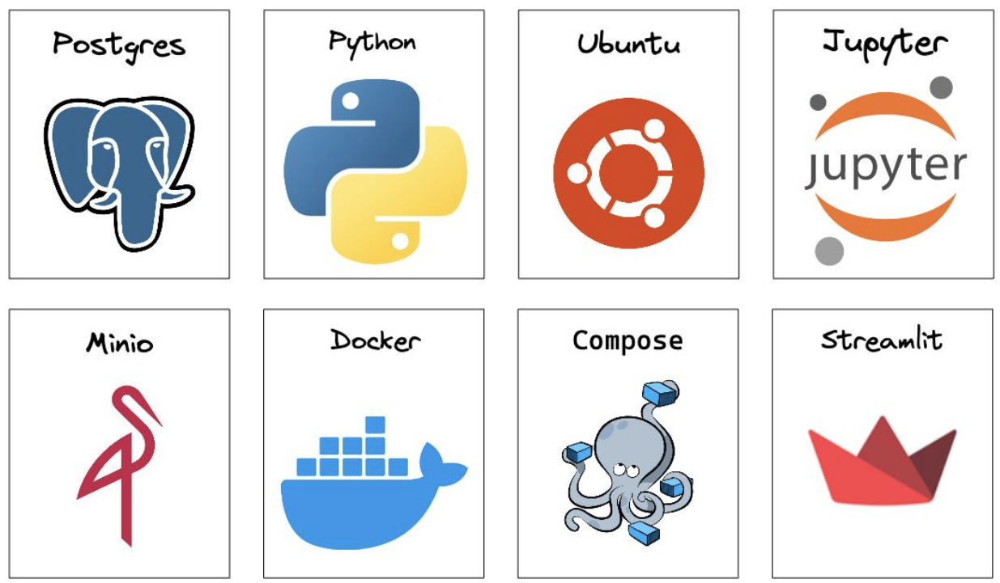

# Deploying Two Tower Search

### Frontend: [simplesearchengine.com](https://simplesearchengine.com)

## Overview

A high-performance semantic search engine built with FastAPI, PyTorch and Faiss. This service provides real-time document search using a Two-Tower RNN model architecture, see [TwoTowerSearch](https://github.com/kalebsofer/TwoTowerSearch) for the model training. The project is fully containerized, scalable, and modularised. It is deployed on a rented Hetzner server.

Trained on: [MS MARCO](https://microsoft.github.io/msmarco/)

### Multi-model system overview:
- Pretrained [Word2Vec](https://arxiv.org/pdf/1301.3781.pdf) style embedding layer
- Two encoding layers which operate in parallel: one for encoding the queries and the other for encoding (both positive and negative) documents. 
- RNNs can encode the queries and documents in a sequential way which preserves information like word order in a piece of text.
- A triplet loss function to train the neural network to make the distance between queries and relevant documents small, and the distance between queries and irrelevant documents large.


### Recursiveness

- At each step, we take the hidden state generated in the previous step by the RNN, and pass it back to the RNN along with the embedding of the next token in our sequence, and the RNN uses these two things to generate the hidden state to be taken to the next step of the process. 
- The final hidden state represents an encoding of the whole sequence, and is the output of the RNN. This encoding is then used for a downstream task, whose loss function we use to train the RNN to make better encodings for that task.
- We slighty modify our RNN so that at each step it outputs not only a hidden state for the next step, but also a prediction for the next token. 
- We then compare these predictions with the actual next tokens via a cross-entropy loss function to train the RNN to become better at making the predictions.


### Inference

- When we get an input query, we use our trained model to encode that query.
- We then compute the distance function between our query encoding and all of our document encodings. We keep the top k (k = 10) documents which have the smallest distance from the query.
- These top k documents are the documents which we return as the k most relevant documents to that query.


## Container Architecture

The architecture is modular and scalable. Docker containers have a single purpose and are designed to be stateless.

- **Frontend**: Hosted using a Streamlit server, accessible at [simplesearchengine.com](https://simplesearchengine.com)
- **Backend**: Retrieves the model and performs inference on incoming queries.
- **Storage**: MinIO is used to store different versions of the model.
- **RDBS**: PostgreSQL is utilized to log user behavior and interactions.
- **Traffic**: Nginx is configured to handle traffic and SSL termination.
- **Reinforcement**: Spins up on a schedule, uses PostgreSQL logs for reinforcement, updates the model weights, and pushes the latest version to MinIO.


## Stack



### Local Dev

- Update `.env.prod` in project root
- Ensure data and model files in your local directory under minio/data/
- Build images:
  ```bash
  docker-compose --env-file .env.prod -f docker-compose.prod.yml build
  ```
- Run containers:
  ```bash
  docker-compose --env-file .env.prod -f docker-compose.prod.yml up -d
  ```
- Merge to main for prod deploy
- To stop containers:
  ```bash
  docker-compose --env-file .env.prod -f docker-compose.prod.yml down
  ```

### Deployment Prerequisites

- [ ] **Remote Server**: Ensure you have a remote server set up.
- [ ] **Project Folder**: Create a project folder on your remote server.
- [ ] **Docker Installed**: Install Docker on your remote server.
- [ ] **Domain Name**: Associate your domain name with your remote server's IP address.
- [ ] **SSL Certificate**: Obtain an SSL certificate for your domain.

## Deployment Steps

1. **Update Domain References**:
   - Search and replace all instances of `inventiveimagecaption.com` in your repository with your actual domain name.

2. **Transfer Files to Remote**:
   - Use `scp` to copy `docker-compose.prod.yml` and `.env.prod` to your project folder on the remote server:
     ```bash
     scp docker-compose.prod.yml .env.prod user@your-remote-ip:/path/to/project-folder/
     ```

3. **Pull Docker Images**:
   - SSH into your remote server and navigate to your project folder. Then, pull the Docker images from Docker Hub:
     ```bash
     docker-compose -f docker-compose.prod.yml pull
     ```

4. **Run Containers**:
   - Start the containers using the `.env.prod` file and the `--no-build` flag:
     ```bash
     docker-compose --env-file .env.prod -f docker-compose.prod.yml up --no-build
     ```